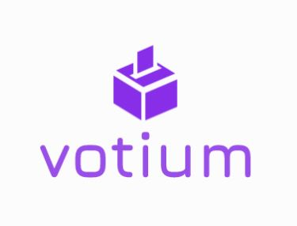

[![Contributors][contributors-shield]][contributors-url]
[![Forks][forks-shield]][forks-url]
[![Stargazers][stars-shield]][stars-url]
[![Issues][issues-shield]][issues-url]
[![MIT License][license-shield]][license-url]
[![LinkedIn][linkedin-shield]][linkedin-url]

<!-- PROJECT LOGO -->
<br />
<p align="center">
  <a href="/">
    
  </a>

  <h3 align="center">Votium</h3>

  <p align="center">
    Safe and Secure voting system using Ethereum. Built with solidity!
    <br />
      <br />
    <a href="https://docs.soliditylang.org/en/v0.8.3/" >
      
    </a>
    &nbsp;&nbsp;&nbsp;
    <a href="https://ethereum.org/en/">
      
    </a>
    <br />
      <br />
    <a href="https://github.com/sreemanthg/Votium"><strong>Explore the docs »</strong></a>
    <br />
    <br />
    <a href="https://github.com/SreemanthG/Votium">View Demo</a>
    ·
    <a href="https://github.com/SreemanthG/Votium/issues">Report Bug</a>
    ·
    <a href="https://github.com/SreemanthG/Votium/issues">Request Feature</a>
  </p>
</p>


<!-- TABLE OF CONTENTS -->
<details open="open">
  <summary>Table of Contents</summary>
  <ol>
    <li>
      <a href="#about-the-project">About The Project</a>
      <ul>
        <li><a href="#built-with">Built With</a></li>
      </ul>
    </li>
    <li>
      <a href="#getting-started">Getting Started</a>
      <ul>
        <li><a href="#prerequisites">Prerequisites</a></li>
        <li><a href="#installation">Installation</a></li>
      </ul>
    </li>
    <li><a href="#usage">Usage</a></li>
    <li><a href="#roadmap">Roadmap</a></li>
    <li><a href="#contributing">Contributing</a></li>
    <li><a href="#license">License</a></li>
    <li><a href="#contact">Contact</a></li>
    <li><a href="#acknowledgements">Acknowledgements</a></li>
  </ol>
</details>


<!-- ABOUT THE PROJECT -->
## About The Project

[![Product Name Screen Shot][product-screenshot]](https://assets.justinmind.com/wp-content/uploads/2018/02/what-is-screen-mockup-header.png)

<!-- <p align="center"></p> -->
There are many great Nodejs boilerplate templates available on GitHub, however, I didn't find one that really suit my needs so I created this enhanced one. I want to create a nodejs template so amazing that it'll be the last one you ever need -- I think this is it.

This application is made for voting the election candidates. It is implemented using ethereum blockchain 

Here's why:
* Eliminates voter frauds
* High level of security
* Transparency of transactions is increased
* Hacking threat reduced


### Built With

These are technologies we used in this application
* [Express](https://getbootstrap.com)
* [Solidity](https://jquery.com)
* [Javascript](https://laravel.com)
* [Ethereum](https://laravel.com)


<!-- GETTING STARTED -->
## Getting Started

This is an example of how you may give instructions on setting up your project locally.
To get a local copy up and running follow these simple example steps.

### Prerequisites

This is an example of how to list things you need to use the software and how to install them.
* npm
  ```sh
  npm install npm@latest -g
  ```
* truffle
  ```sh
  npm install truffle -g
  ```
* [ganache](https://www.trufflesuite.com/ganache)
  

 

### Installation

1. Clone the repo
   ```sh
   git clone https://github.com/SreemanthG/Votium.git
   ```
2. Install NPM packages
   ```sh
   cd Votium
   npm install
   ```
3. Compile and Migrate
   ```sh
   truffle compile
   truffle migrate
   ```
   (note: make sure that ganache gui is running in the background)
4. Run the project
   ```sh
   npm run dev
   ```


<!-- USAGE EXAMPLES -->
## Usage

Use this demo video to understand about the project.

_For more examples, please refer to the [Documentation](https://example.com)_


<!-- ROADMAP -->
## Roadmap

See the [open issues](https://github.com/sreemanthg/node-boilerplate-template/issues) for a list of proposed features (and known issues).


<!-- CONTRIBUTING -->
## Contributing

Contributions are what make the open source community such an amazing place to be learn, inspire, and create. Any contributions you make are **greatly appreciated**.

1. Fork the Project
2. Create your Feature Branch (`git checkout -b feature/AmazingFeature`)
3. Commit your Changes (`git commit -m 'Add some AmazingFeature'`)
4. Push to the Branch (`git push origin feature/AmazingFeature`)
5. Open a Pull Request


<!-- LICENSE -->
## License

Distributed under the MIT License. See `LICENSE` for more information.


<!-- CONTACT -->
## Contact
Feel free to send feedback on [Twitter](https://twitter.com/GSreemanth) or [file an issue](https://github.com/SreemanthG/meetings-api-appointy/issues/new). Feature requests are always welcome. You can contact me at 

Sreemanth Gourishetty - [@GSreemanth](https://twitter.com/GSreemanth) - sreemanth2001@gmail.com

Project Link: [https://github.com/SreemanthG/Votium](https://github.com/SreemanthG/Votium)


<!-- ACKNOWLEDGEMENTS -->
## Acknowledgements
* [GitHub Emoji Cheat Sheet](https://www.webpagefx.com/tools/emoji-cheat-sheet)
* [Img Shields](https://shields.io)
* [Choose an Open Source License](https://choosealicense.com)
* [GitHub Pages](https://pages.github.com)
* [Animate.css](https://daneden.github.io/animate.css)
* [Loaders.css](https://connoratherton.com/loaders)
* [Slick Carousel](https://kenwheeler.github.io/slick)
* [Smooth Scroll](https://github.com/cferdinandi/smooth-scroll)
* [Sticky Kit](http://leafo.net/sticky-kit)
* [JVectorMap](http://jvectormap.com)
* [Font Awesome](https://fontawesome.com)


<!-- MARKDOWN LINKS & IMAGES -->
<!-- https://www.markdownguide.org/basic-syntax/#reference-style-links -->
[contributors-shield]: https://img.shields.io/github/contributors/othneildrew/Best-README-Template.svg?style=for-the-badge
[contributors-url]: https://github.com/SreemanthG/Votium/graphs/contributors
[forks-shield]: https://img.shields.io/github/forks/othneildrew/Best-README-Template.svg?style=for-the-badge
[forks-url]: https://github.com/SreemanthG/Votium/network/members
[stars-shield]: https://img.shields.io/github/stars/othneildrew/Best-README-Template.svg?style=for-the-badge
[stars-url]: https://github.com/SreemanthG/Votium/stargazers
[issues-shield]: https://img.shields.io/github/issues/othneildrew/Best-README-Template.svg?style=for-the-badge
[issues-url]: https://github.com/SreemanthG/Votium/issues
[license-shield]: https://img.shields.io/github/license/othneildrew/Best-README-Template.svg?style=for-the-badge
[license-url]: https://github.com/SreemanthG/Votium/blob/master/LICENSE
[linkedin-shield]: https://img.shields.io/badge/-LinkedIn-black.svg?style=for-the-badge&logo=linkedin&colorB=555
[linkedin-url]: https://linkedin.com/in/sreemanth-gourishetty-b60a48182/
[product-screenshot]: https://assets.justinmind.com/wp-content/uploads/2018/02/what-is-screen-mockup-header.png
